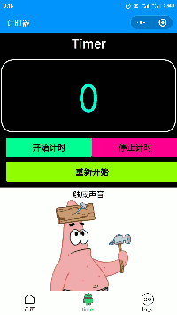
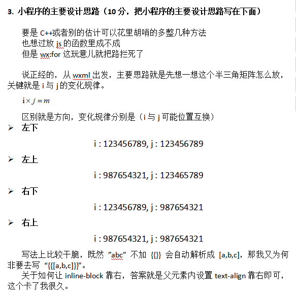
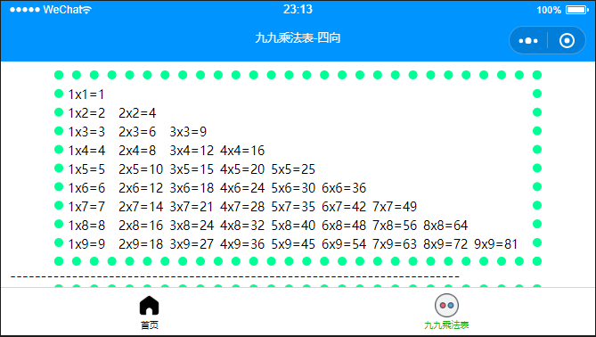
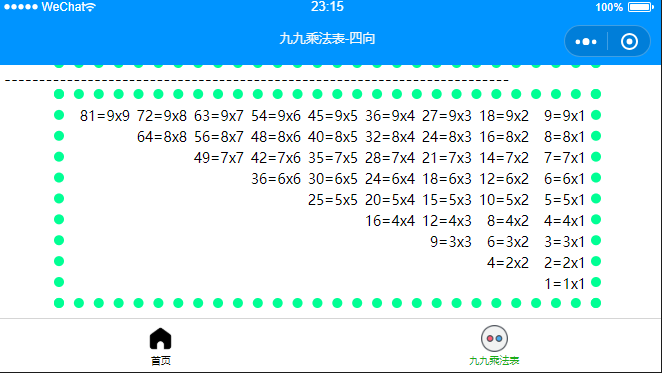

# NCUTMOOCWeChatMiniProgramUnitworks

---

## 北方工业大学杜老师Mooc课程地址
https://www.icourse163.org/learn/NCUT-1206419808?tid=1450238453#/learn/announce

---

Markdown菜鸟教程地址：https://www.runoob.com/markdown/md-tutorial.html

---

## Week3 

### 关于计时器的一个bug及解决       Feb 27th, 2020

做作业的时候发现：

  当  多次（连续，非快速）  点击“开始计时”时，时间会根据你点击的次数进行 每秒*点击次数  跃变，并且无法停止计时

  例如，连续点击两下开始计时，时间会每秒连续-1两次，隔一秒从46（看得到45）变到44,下一秒44到42，此时点击停止计时，会恢复成每秒-1，但是再也无法停止

  研究了一下代码，猜测是因为每次的start()函数中无条件调用了timer()函数，导致num--操作叠加，至于为何会叠加甚至无法停止，我也不太清楚（早知道当初学HTML的时候好好把JS学透了），希望老师看到&&有空的话可以做一个解说

```javascript
start: function() { //开始计时函数
   var that = this;
   timerID = setInterval(() => {
     that.timer()
   }, 1000) //每隔1s调用一次timer函数，注意与setTimeout区别，一个是一次，一个是连续多次，而且这里有timerID
},
```

在作业中尝试了一下可以利用一个标识变量flag很简单地解决这个bug，代码有些不一样，不妨碍理解

```javascript
data: {
    btncolor:[ "#00ff94","#ff0094","#94ff00" ],
    num: num,
    flag: flag
},

start: function() {
    var that=this;
    if ( flag==1 ){
        timerID = setInterval(() => {
        that.timer()
    	}, 10);
    	flag = 0;
    }
},
stop: function() {
    var that = this;
    flag = 1;
    clearInterval(timerID)
    },
    restart: function() {
        var that=this;
        num = 0;
        flag = 1;
        that.setData({
            num:0
    })
},

timer: function() {
    var that=this;
    console.log(num,flag)
    if ( num >= 0 && num <=999999 ){  /*避免无限计时*/
            that.setData({
            num: (num+=0.01).toFixed(2)
        })
        } else {
            that.setData({
            num:0
        })
        console.log(num,flag)
    }
},
```

效果（触底声音因为不知道有什么声音素材网站，就自己用jijidown下载的B站上的几个海绵宝宝动画然后挑一个用pr剪的声音，这一集是哥俩在手套节坐车坐过站到一片更深的海底深渊的故事，声音是派大星看见“离开比奇堡海滩”牌子问海绵宝宝时的）：



---


## Week5  渲染与引用

### 四向九九乘法表 March,20 th

两个点，

-  i与j的变化规律
- 如何靠右排版



代码：

```xml
<!--pages/chfb/chfb.wxml-->
<!-- <text>pages/chfb/chfb.wxml</text> -->
<!-- 本想用类似递归的方法，奈何wx:for只能用于数组对象 -->
<!-- inline-block为行内块元素，想让其内部块靠右,在父元素里面使用text-align -->
<view class="con">
    <view class="chfbox">
        <view wx:for="123456789" wx:for-item="i">
            <view class="inlineblock" wx:for="123456789" wx:for-item="j" wx:if="{{j<=i}}">
                {{j}}x{{i}}={{i*j}}
            </view>
        </view>
    </view>
-------------------------------------------------------------------------
    <view class="chfbox">
        <view wx:for="987654321" wx:for-item="i">
            <view class="inlineblock" wx:for="123456789" wx:for-item="j" wx:if="{{j<=i}}">
                {{j}}x{{i}}={{i*j}}
            </view>
        </view>
    </view>
-------------------------------------------------------------------------
    <view class="chfbox">
        <view wx:for="123456789" wx:for-item="i" style="text-align:right;">
            <view class="inlineblock2" wx:for="987654321" wx:for-item="j" wx:if="{{j<=i}}">
                {{i*j}}={{i}}x{{j}}
            </view>
        </view>
    </view>
-------------------------------------------------------------------------
    <view class="chfbox">
        <view wx:for="987654321" wx:for-item="i" style="text-align:right;">
            <view class="inlineblock2" wx:for="987654321" wx:for-item="j" wx:if="{{j<=i}}">
                {{i*j}}={{i}}x{{j}}
            </view>
        </view>
    </view>
</view>
```

效果（说明：竖屏不够，横屏来凑，规格为：iPhone 7 横屏 667x375 | Dpr:2）：





### 模板定义与引用

**index.js**

```
data{
	stu01:{
		name:'张三',
		age:'21',
		gender:'男'
		},
	stu02:{
		name:'李四',
		age:'19',
		gender:'女'
	}
}
```

**index.wxml**

```xml
    <import src='template.wxml'/>
    <template is='student' data="{{...stu01}}"/>
    ---------------------------------------------
    <template is='student' data="{{...stu02}}"/>
    ---------------------------------------------
    <template is='student' data="{{name:'王五',age:'20',gender:'男'}}"/>
```

​	注：如果A import B, B import C，那么A只能引用B中的template模板，即  **<u>import不具有传递性</u>**

**template.wxml**

```xml
<template name='student'>
    <view>name:{{name}}</view>
    <view>age:{{age}}</view>
    <view>gender:{{gender}}</view>
</template>
```


### include 引用

```xml
	<include src='header.wxml'/>
```

​	import只能引用文件中的template，而 include 可以引用文件中除了\<template/\>和\<wxs/\>之外的整个代码，相当于将目标文件中的代码拷贝到include位置。


---

## Week 6  小程序组件（1）

### 6.1 货币兑换

（边上课边记，回顾一下前面的知识和记录新的知识）

**WXML**

```html
<view class='title'>货币兑换</view>
  <form bindsubmit='calc' bindreset='reset'>
    <input name='cels' placeholder='请输入人民币金额' type='number' auto-focus='true'></input>
    <view class='btnLayout'>
      <button type='primary' form-type='submit'>计算</button>
      <button type='primary' form-type='reset'>清除</button>
    </view>
    <view class='textLayout'>
      <text>兑换美元为：{{M}}</text>
      <text>兑换英镑为：{{Y}}</text>
      <text>兑换港币为：{{G}}</text>
      <text>兑换欧元为：{{O}}</text>
      <text>兑换韩元为：{{H}}</text>
      <text>兑换日元为：{{R}}</text>
    </view>
  </form>
```

​	**form组件**（表单组件）：提交内部所包含交互组件（input, switch, slider, radio, checkbox, picker）的用户输入值，同时提交多个，相当于批处理

​		属性：

​			bindsubmit：携带form中的数据触发submit事件

​			bindreset：表单重置时触发reset事件

​		获取form内各组件value值的方法：

​			当点击form表单中form-type为submit的button组件时，会将变淡内各组件的value值提交。（注意：需要设置表单内各组件的name属性，以区分）

​		案例中这俩属性与按钮中的form-type属性（submit、reset）相关联，而其绑定的函数在js中定义

​	

​	**input组件**：

​		placeholder——占位符

​		type——弹出键盘类型，number数字键盘，好处——<u>不用再另外判断输入为非数字数据</u>

​		auto-focus（bool）——自动聚焦

​	

​	button:

​		type——primary，按钮样式类型：主要


**WXSS**

dispaly——布局模式，flex-弹性布局

flex-direction——弹性盒子主轴方向，row/column

justyfy-content——沿主轴方向对齐方式，center居中对齐

align-items——沿交叉轴方向对齐方式，flex-start左对齐


**JS，逻辑设计**

​	**calc()**

​	取得输入框的值：e.detail.value，这里有表单，后面还得加input组件的名字（wxml里面必须有定义），e.detail.value.cels

​	parseInt——输入框取得的值都是字符串，转换成整数

​	num.toFixed(4)——num保留小数点后4位

​	

​	**reset()**

​	重置为 ‘’ 空字符串（中间没有空格）


另外，别忘了鼠标中键的强大。(~~这个水印也是醉了~~)


### 6.2 三角形面积计算器

用的是海伦公式（~~完了不会用Markdown写公式，很方~~~）：
$$
p=\frac{a+b+c}{2} 	（海伦因子）\\	
S=\sqrt{p(p-a)(p-b)(p-c)}
$$
[^Markdown中的数学公式]: 当你需要在编辑器中插入数学公式时，可以使用两个美元符 $$ 包裹 TeX 或 LaTeX 格式的数学公式来实现。提交后，问答和文章页会根据需要加载 Mathjax 对数学公式进行渲染

在线LaTeX数学公式编辑器：https://latex.91maths.com/

（找了我好久的资料，舍本逐末？）


代码：

WXML

```html
<view class="box">
  <view class='title'>三角形面积计算器</view>
  <form bindsubmit="formSubmit">
    输入三角形的三条边长：
    <input type="digit" placeholder='第1条边长' name='a' value='{{a}}' />
    <input type="digit" placeholder='第2条边长' name='b' value='{{b}}' />
    <input type="digit" placeholder='第3条边长' name='c' value='{{c}}' />
    <button form-type='submit'>计算</button>
  </form>
  <text>三角形的面积为：{{result}}</text>
</view>
```

js

```javascript
formSubmit: function(e) {
    var a = parseFloat(e.detail.value.a); //将input组件的value值转换为实数类型并赋值给变量a
    var b = parseFloat(e.detail.value.b); //将input组件中的value值转换为实数类型并赋值给变量b
    var c = parseFloat(e.detail.value.c); //将input组件中的value值转换为实数类型并赋值给变量c
    var area; //定义存放面积的变量
    if (a + b <= c || a + c <= b || b + c <= a) { //如果三角形的两边之和小于第三边
      wx.showToast({ //调用API函数显示提示对话框
        title: '三角形的两边之和小于第三边！', //对话框标题
        icon: 'none', //对话框图标
        duration: 2000, //对话框显示时长
      });
      this.clear(); //调用函数清空input组件中的数据
      return;
    } else { //计算三角形面积
      var s = (a + b + c) / 2;
      area = Math.sqrt(s * (s - a) * (s - b) * (s - c))
    }
    this.setData({
      result: area //将三角形面积渲染到视图层
    });
  },
  clear: function () { //清空input组件中输入的数据
    this.setData({
      a: '',
      b: '',
      c: '',
      result: ''
    })
  }
```

有了6.1 这里应该不难懂，不同的是input组件里面多了一个value="{{a}}"，绑定了js中的a,b,c变量(在formsubmit中声名并定义了)

​	老样子,	parseFloat(e.detail.value.a)，参数e代表的是点击按钮的事件，detail为事件中的组件，value就是组件的值，a指定具体组件


注意这里要判断三边是否构成三角形	（~~接下来是不是要开始写输入日期判断星期了哈哈哈~~）

几个常用API函数：

- wx.showToast(Object object)，类似安卓里面的toast，显示消息提示框，

  |   属性   |                说明                |          值          |
  | :------: | :--------------------------------: | :------------------: |
  |  title   |             提示的内容             |        string        |
  |   icon   |                图标                | success,loading,none |
  |  image   | 自定义图标本地路径，优先级高于icon |                      |
  | duration |            延迟时间，ms            |                      |
  |   mask   |   是否显示透明蒙层，防止触摸穿透   |                      |
  | success  |       接口调用成功的回调函数       |                      |
  |   fail   |       接口调用失败的回调函数       |                      |
  | complete |       接口调用结束的回调函数       |                      |

- wx.hideToast，隐藏消息提示框

- wx.showLoading，显示loading提示框

- wx.hideLoading，隐藏loading提示框

- wx.showModal，显示模态对话框


讨论区题目是一元二次方程求根，hhhh（~~快2点了，溜了溜了~~）


## Week 7  小程序组件（2）


**学的很渣，欢迎交流指教！**

