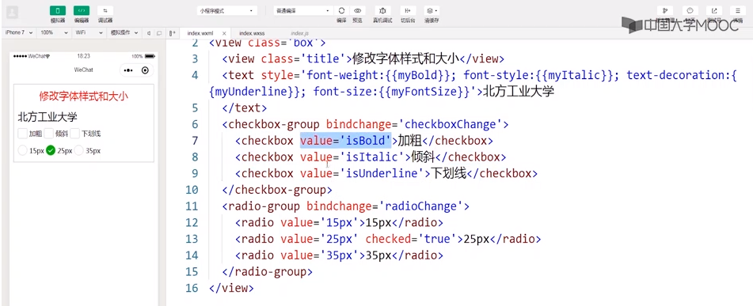
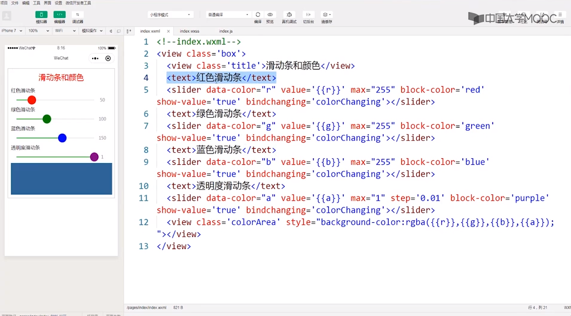

# NCUTMOOCWeChatMiniProgramUnitworks

---

## 北方工业大学杜老师Mooc课程地址
https://www.icourse163.org/learn/NCUT-1206419808?tid=1450238453#/learn/announce

---

Markdown菜鸟教程地址：https://www.runoob.com/markdown/md-tutorial.html

微信小程序官方文档：https://developers.weixin.qq.com/miniprogram/dev/framework/

---

## Week 2  盒模型与页面布局

### 2.3 导航与布局

**navigator组件**：https://developers.weixin.qq.com/miniprogram/dev/component/navigator.html

|   属性    |                             说明                             |
| :-------: | :----------------------------------------------------------: |
|  target   |   在哪个目标上发生跳转，合法值为self（默认）和miniProgram    |
|    url    |                     当前小程序内跳转地址                     |
| open-type |                           跳转方式                           |
|   delta   |      当open-type为 'navigateBack' 时有效，表示回退层数       |
|  app-id   |      当target='miniProgram'时有效，要打开的小程序appID       |
|   path    | 当target='miniProgram'时有效，打开的页面路径，为空则打开首页 |

open-type合法值：

|      值      |                     说明                     |
| :----------: | :------------------------------------------: |
|   navigate   |     保留当前页面，跳转到应用内的某个页面     |
|   redirect   |     关闭当前页面，跳转到应用内的某个页面     |
|  switchTab   | 跳转到tabBar页面，并关闭其他所有非tabBar页面 |
|   reLaunch   |      关闭所有页面，打卡应用内的某个页面      |
| navigateBack |     关闭当前页面，返回上一页面或多级页面     |
|     exit     |    退出小程序，target="miniProgram"时有效    |


---

## Week 3 

### 关于计时器的一个bug及解决       Feb 27th, 2020

做作业的时候发现：

  当  多次（连续，非快速）  点击“开始计时”时，时间会根据你点击的次数进行 每秒*点击次数  跃变，并且无法停止计时

  例如，连续点击两下开始计时，时间会每秒连续-1两次，隔一秒从46（看得到45）变到44,下一秒44到42，此时点击停止计时，会恢复成每秒-1，但是再也无法停止

  研究了一下代码，猜测是因为每次的start()函数中无条件调用了timer()函数，导致num--操作叠加，至于为何会叠加甚至无法停止，我也不太清楚（早知道当初学HTML的时候好好把JS学透了），希望老师看到&&有空的话可以做一个解说

```javascript
start: function() { //开始计时函数
   var that = this;
   timerID = setInterval(() => {
     that.timer()
   }, 1000) //每隔1s调用一次timer函数，注意与setTimeout区别，一个是一次，一个是连续多次，而且这里有timerID
},
```

在作业中尝试了一下可以利用一个标识变量flag很简单地解决这个bug，代码有些不一样，不妨碍理解

```javascript
data: {
    btncolor:[ "#00ff94","#ff0094","#94ff00" ],
    num: num,
    flag: flag
},

start: function() {
    var that=this;
    if ( flag==1 ){
        timerID = setInterval(() => {
        that.timer()
    	}, 10);
    	flag = 0;
    }
},
stop: function() {
    var that = this;
    flag = 1;
    clearInterval(timerID)
    },
    restart: function() {
        var that=this;
        num = 0;
        flag = 1;
        that.setData({
            num:0
    })
},

timer: function() {
    var that=this;
    console.log(num,flag)
    if ( num >= 0 && num <=999999 ){  /*避免无限计时*/
            that.setData({
            num: (num+=0.01).toFixed(2)
        })
        } else {
            that.setData({
            num:0
        })
        console.log(num,flag)
    }
},
```

效果（触底声音因为不知道有什么声音素材网站，就自己用jijidown下载的B站上的几个海绵宝宝动画然后挑一个用pr剪的声音，这一集是哥俩在手套节坐车坐过站到一片更深的海底深渊的故事，声音是派大星看见“离开比奇堡海滩”牌子问海绵宝宝时的）：


---


## Week5  渲染与引用

### 四向九九乘法表 March,20 th

两个点，

-  i与j的变化规律
- 如何靠右排版


代码：

```xml
<!--pages/chfb/chfb.wxml-->
<!-- <text>pages/chfb/chfb.wxml</text> -->
<!-- 本想用类似递归的方法，奈何wx:for只能用于数组对象 -->
<!-- inline-block为行内块元素，想让其内部块靠右,在父元素里面使用text-align -->
<view class="con">
    <view class="chfbox">
        <view wx:for="123456789" wx:for-item="i">
            <view class="inlineblock" wx:for="123456789" wx:for-item="j" wx:if="{{j<=i}}">
                {{j}}x{{i}}={{i*j}}
            </view>
        </view>
    </view>
-------------------------------------------------------------------------
    <view class="chfbox">
        <view wx:for="987654321" wx:for-item="i">
            <view class="inlineblock" wx:for="123456789" wx:for-item="j" wx:if="{{j<=i}}">
                {{j}}x{{i}}={{i*j}}
            </view>
        </view>
    </view>
-------------------------------------------------------------------------
    <view class="chfbox">
        <view wx:for="123456789" wx:for-item="i" style="text-align:right;">
            <view class="inlineblock2" wx:for="987654321" wx:for-item="j" wx:if="{{j<=i}}">
                {{i*j}}={{i}}x{{j}}
            </view>
        </view>
    </view>
-------------------------------------------------------------------------
    <view class="chfbox">
        <view wx:for="987654321" wx:for-item="i" style="text-align:right;">
            <view class="inlineblock2" wx:for="987654321" wx:for-item="j" wx:if="{{j<=i}}">
                {{i*j}}={{i}}x{{j}}
            </view>
        </view>
    </view>
</view>
```

效果（说明：竖屏不够，横屏来凑，规格为：iPhone 7 横屏 667x375 | Dpr:2）：


### 模板定义与引用

**index.js**

```
data{
	stu01:{
		name:'张三',
		age:'21',
		gender:'男'
		},
	stu02:{
		name:'李四',
		age:'19',
		gender:'女'
	}
}
```

**index.wxml**

```xml
    <import src='template.wxml'/>
    <template is='student' data="{{...stu01}}"/>
    ---------------------------------------------
    <template is='student' data="{{...stu02}}"/>
    ---------------------------------------------
    <template is='student' data="{{name:'王五',age:'20',gender:'男'}}"/>
```

​	注：如果A import B, B import C，那么A只能引用B中的template模板，即  **<u>import不具有传递性</u>**

**template.wxml**

```xml
<template name='student'>
    <view>name:{{name}}</view>
    <view>age:{{age}}</view>
    <view>gender:{{gender}}</view>
</template>
```


### include 引用

```xml
	<include src='header.wxml'/>
```

​	import只能引用文件中的template，而 include 可以引用文件中除了\<template/\>和\<wxs/\>之外的整个代码，相当于将目标文件中的代码拷贝到include位置。


---

## Week 6  小程序组件（1）

### 6.1 货币兑换

（边上课边记，回顾一下前面的知识和记录新的知识）

**WXML**

```html
<view class='title'>货币兑换</view>
  <form bindsubmit='calc' bindreset='reset'>
    <input name='cels' placeholder='请输入人民币金额' type='number' auto-focus='true'></input>
    <view class='btnLayout'>
      <button type='primary' form-type='submit'>计算</button>
      <button type='primary' form-type='reset'>清除</button>
    </view>
    <view class='textLayout'>
      <text>兑换美元为：{{M}}</text>
      <text>兑换英镑为：{{Y}}</text>
      <text>兑换港币为：{{G}}</text>
      <text>兑换欧元为：{{O}}</text>
      <text>兑换韩元为：{{H}}</text>
      <text>兑换日元为：{{R}}</text>
    </view>
  </form>
```

​	**form组件**（表单组件）：提交内部所包含交互组件（input, switch, slider, radio, checkbox, picker）的用户输入值，同时提交多个，相当于批处理。提交事件由button按钮完成

​		属性：

​			bindsubmit：携带form中的数据触发submit事件

​			bindreset：表单重置时触发reset事件

​		获取form内各组件value值的方法：

​			当点击form表单中form-type为submit的button组件时，会将变淡内各组件的value值提交。（注意：需要设置表单内各组件的name属性，以区分）

​		案例中这俩属性与按钮中的form-type属性（submit、reset）相关联，而其绑定的函数在js中定义

​	

​	**input组件**：

​		placeholder——占位符

​		type——弹出键盘类型，number数字键盘，好处——<u>不用再另外判断输入为非数字数据</u>

​		auto-focus（bool）——自动聚焦

​	

​	button:

​		type——primary，按钮样式类型：主要


**WXSS**

dispaly——布局模式，flex-弹性布局

flex-direction——弹性盒子主轴方向，row/column

justyfy-content——沿主轴方向对齐方式，center居中对齐

align-items——沿交叉轴方向对齐方式，flex-start左对齐


**JS，逻辑设计**

​	**calc()**

​	取得输入框的值：e.detail.value，这里有表单，后面还得加input组件的名字（wxml里面必须有定义），e.detail.value.cels

​	parseInt——输入框取得的值都是字符串，转换成整数（但是js中，这个字符串是可以参与乘除运算的）

​	num.toFixed(4)——num保留小数点后4位

​	

​	**reset()**

​	重置为 ‘’ 空字符串（中间没有空格）


另外，别忘了鼠标中键的强大。(~~这个水印也是醉了~~)


### 6.2 三角形面积计算器

用的是海伦公式（~~完了不会用Markdown写公式，很方~~~）：
$$
p=\frac{a+b+c}{2} 	（海伦因子）\\	
S=\sqrt{p(p-a)(p-b)(p-c)}
$$
[^Markdown中的数学公式]: 当你需要在编辑器中插入数学公式时，可以使用两个美元符 $$ 包裹 TeX 或 LaTeX 格式的数学公式来实现。提交后，问答和文章页会根据需要加载 Mathjax 对数学公式进行渲染

在线LaTeX数学公式编辑器：https://latex.91maths.com/

（原来csdn blog编辑器也有这个，找了我好久的资料，舍本逐末？）


代码：

WXML

```html
<view class="box">
  <view class='title'>三角形面积计算器</view>
  <form bindsubmit="formSubmit">
    输入三角形的三条边长：
    <input type="digit" placeholder='第1条边长' name='a' value='{{a}}' />
    <input type="digit" placeholder='第2条边长' name='b' value='{{b}}' />
    <input type="digit" placeholder='第3条边长' name='c' value='{{c}}' />
    <button form-type='submit'>计算</button>
  </form>
  <text>三角形的面积为：{{result}}</text>
</view>
```

js

```javascript
formSubmit: function(e) {
    var a = parseFloat(e.detail.value.a); //将input组件的value值转换为实数类型并赋值给变量a
    var b = parseFloat(e.detail.value.b); //将input组件中的value值转换为实数类型并赋值给变量b
    var c = parseFloat(e.detail.value.c); //将input组件中的value值转换为实数类型并赋值给变量c
    var area; //定义存放面积的变量
    if (a + b <= c || a + c <= b || b + c <= a) { //如果三角形的两边之和小于第三边
      wx.showToast({ //调用API函数显示提示对话框
        title: '三角形的两边之和小于第三边！', //对话框标题
        icon: 'none', //对话框图标
        duration: 2000, //对话框显示时长
      });
      this.clear(); //调用函数清空input组件中的数据
      return;
    } else { //计算三角形面积
      var s = (a + b + c) / 2;
      area = Math.sqrt(s * (s - a) * (s - b) * (s - c))
    }
    this.setData({
      result: area //将三角形面积渲染到视图层
    });
  },
  clear: function () { //清空input组件中输入的数据
    this.setData({
      a: '',
      b: '',
      c: '',
      result: ''
    })
  }
```

有了6.1 这里应该不难懂，不同的是input组件里面多了一个value="{{a}}"，绑定了js中的a,b,c变量(在formsubmit中声名并定义了)

​	老样子,	parseFloat(e.detail.value.a)，参数e代表的是点击按钮的事件，detail为事件中的组件，value就是组件的值，a指定具体组件


注意这里要判断三边是否构成三角形	（~~接下来是不是要开始写输入日期判断星期了哈哈哈~~）

几个常用API函数：

- wx.showToast(Object object)，类似安卓里面的toast，显示消息提示框，

  |   属性   |                说明                |          值          |
  | :------: | :--------------------------------: | :------------------: |
  |  title   |             提示的内容             |        string        |
  |   icon   |                图标                | success,loading,none |
  |  image   | 自定义图标本地路径，优先级高于icon |                      |
  | duration |            延迟时间，ms            |                      |
  |   mask   |   是否显示透明蒙层，防止触摸穿透   |                      |
  | success  |       接口调用成功的回调函数       |                      |
  |   fail   |       接口调用失败的回调函数       |                      |
  | complete |       接口调用结束的回调函数       |                      |

- wx.hideToast(Object object)，隐藏消息提示框

- wx.showLoading(Object object)，显示loading提示框

- wx.hideLoading(Object object)，隐藏loading提示框

- wx.showModal(Object object)，显示模态对话框


讨论区题目是一元二次方程求根，hhhh（~~快2点了，溜了溜了~~）


### 6.3 设置字体样式和大小

​	利用radio组件改变字体类型，利用checkbox组件改变字体加粗、倾斜和下划线等样式。我感觉应该是改变之前静态样式，转变成通过用户交互动态设置样式

​	~~class只能设置静态，动态的话就得用style~~

**WXML**



​	checkbox-group里面的多个checkbox通过value区分，所以都要有。（类似前面的form中的input的name等）radio-group也一样。checkbox与radio两者本身的样式仍旧可以通过wxss定义。

​	bindchange就是改变点选时发生的绑定事件

​	checked='true'，表示初始时被选中

​	checkbox可以多选，但是同组radio应只能同时存在一个

**JS**

```javascript
data: {
    myFontSize: '25px' //设置字体初始大小
  },
  checkboxChange: function(e) { //checkbox组件事件函数
    var text = []; //定义存放checkbox选项的数组
    var mybold = ''; //定义是否加粗的变量
    var myitalic = ''; //定义是否倾斜的变量
    var myunderline = ''; //定义是否有下划线的变量
    text = e.detail.value; //将checkbox的所有选中项的value值赋值给text
    for (var i = 0; i < text.length; i++) { //利用循环判断选中了checkbox的哪些选项
      if (text[i] == 'isBold') { //如果加粗的checkbox组件被选中
        mybold = 'bold'; //将加粗的属性值bold赋值给局部变量mybold
      }
      if (text[i] == 'isItalic') {//如果倾斜的checkbox组件被选中
        myitalic = 'italic';
      }
      if (text[i] == 'isUnderline') {//如果下划线的checkbox组件被选中
        myunderline = 'underline';
      }
    }
    this.setData({
      myBold: mybold, //将局部变量赋值给绑定变量并渲染到视图层
      myItalic: myitalic,
      myUnderline: myunderline,
    })
    console.log(text) //在console中显示提示信息
  },
  radioChange: function(e) { //radio组件事件函数
    this.setData({
      myFontSize: e.detail.value, //将radio的value值赋值给绑定变量myFontSize
    })
    console.log(e.detail.value) //在console中显示提示信息
  }
```

​	checkbox这里是将三个选项放在同一个列表（数组？）里，也说明了checkbox-group的bindchange事件的组件的值，是一个包含每个CheckBox的值的列表

​	而每次勾选和取勾都会触发一次checkbox的change事件，text[]又经历从空到检查添加元素的过程

​	

​	checkbox为多选项目组件，必须和checkbox-group多项选择器一起使用

​	而radio单选项目组件，因为value就是需要的样式参数，**必须有且必须只有**一个，所以直接e.detail.value就行了

**组件**

|            组件            |    属性    |                           说明                           |
| :------------------------: | :--------: | :------------------------------------------------------: |
|       radio/checkbox       |   value    | 组件标识。当选中或者去选时，group的change事件会携带value |
|       radio/checkbox       |  checked   |     当前是否选中，true or false，可用来设置默认选中      |
|       radio/checkbox       |  disabled  |                         是否禁用                         |
|       radio/checkbox       |   color    |                           颜色                           |
| radio-group/checkbox-group | bindchange |                选中项改变时触发change事件                |


### 6.4  滑动条和颜色

​	利用slider滑动条控制颜色变化（和Android里的seekbar相似），案例中的颜色是几个混起来的，RGBA

**WXML**



​	注意这个事件名字不叫change了，人家全名叫 **bindchanging** ，

​	四个滑动条代码都好说，有一点注意的是，因为滑动数值变化步长step默认为1，所以透明度a中属性 step改小成0.01，当然这个也可以通过JS解决，但没这么方便直接

​	同样的，动态样式只能在wxml文件中用style实现，所以这里唯独需要把bgc（backgroud-color）放在这里。颜色的表示除了#FFFFFF，可用如图这样的rgba(r,g,b,a)函数（还有一个rgb函数）表示，注意每个参数的范围（255和1）

**slider组件**

|    常用属性     |                       说明                        |
| :-------------: | :-----------------------------------------------: |
|       min       |                                                   |
|       max       |                                                   |
|      step       |   步长，取值必须大于0，并且可被（max-min）整除    |
|      value      |                     当前取值                      |
|   activeColor   |   已选择的颜色，滑块划过区域颜色，—0—的左边部分   |
| backgroundColor | 背景条颜色，与上面组成滑动条的背景，—0—的右边部分 |
|   block-size    |              滑块大小，取值范围12-28              |
|   block-color   |                    滑块的颜色                     |
|   show-value    |           是否显示当前value，true/false           |
|   bindchange    |              完成一次拖动后触发事件               |
|  bindchanging   |                拖动过程中触发事件                 |

​	组件的	data-*	属性：

​		用于存储页面或应用程序的私有自定义数据，存储的数据能够在JS中使用。

​		属性名：不能包含任何大写字母，并且在 "data-" 之后必须至少有一个字符

​		属性值：可以是任意字符串，获得方法是 e.currentTarget.dataset.*

（莫不是说不只是slider有这个属性？）


**JS**

```javascript
  data: {
    r: 50,
    g: 100,
    b: 150,
    a: 1
  },
  colorChanging(e) { 
    let color = e.currentTarget.dataset.color //获取当前slider组件的data-color值
    let value = e.detail.value; //获取当前slider组件的value值
    console.log(color,value) //在console中显示信息
    this.setData({
      [color]: value //将value值赋值给数组color
    })
  }
```

​	vue，js基础不够到这里就有点尴尬了	

​	这个函数，首先开头么有'：function'，

​	参数e，滑动事件。currentTarget，顾名思义，当前使用的目标组件。dataset，~~slider~~组件中以data开头的属性集，在本案例中只有一个data-color，color就是指data-color值了，比如为’r‘。

​	e.detail.value，当前组件的value值，~~至于为什么不同上面一样用current，别问我。~~这里指的是slider滑块的值


​	\[color\]:value，老师说的是动态数组赋值，color本身为数组，赋值时要先[]括起来。由案例演示可见，滑动时，color的值就是 r，g，b，a 中的一个，value就是对应滑动到的值。我好奇的是为什么要如此?


​	**let** 声明的变量（或者改变变量值的动作）只在 let 命令所在的代码块内有效。ES6之后，有块级作用域的概念，就是使用关键字let实现。这里好像是与colorchanging并非一个正常的function有关

​	具体信息见Runoob:https://www.runoob.com/js/js-let-const.html

​	

### 6.5 轮播图Swiper和开关选择器

 	通过switch组件控制swiper组件的属性

​	~~讲真这个案例的操作和我之前做过的小程序轮播图不太一样~~

**WXML**

```html
<view class='box'>
  <view class='title'>Swiper And Switch</view>
  <swiper indicator-dots="{{indicatorDots}}" autoplay="{{autoplay}}" circular="{{circular}}" vertical="{{vertical}}" interval="{{interval}}" duration="{{duration}}">
    <block wx:for="{{background}}" wx:key="{{index}}">
      <swiper-item>
        <view class="{{item}}"></view>
      </swiper-item>
    </block>
  </swiper>
  <view class='waikuang'>
    <text class='myLeft'>指示点</text>
    <switch checked='{{indicatorDots}}' bindchange="changeIndicatorDots" />
  </view>
  <view class='waikuang'>
    <text class='myLeft'>自动播放</text>
    <switch checked="{{autoplay}}" bindchange="changeAutoplay" />
  </view>
  <view class='waikuang'>
    <text class='myLeft'>衔接滑动</text>
    <switch checked="{{circular}}" bindchange="changeCircular" />
  </view>
  <view class='waikuang'>
    <text class='myLeft'>竖向</text>
    <switch checked="{{vertical}}" bindchange="changeVertical" />
  </view>
</view>
```

​	这个swiper-item的class话说好像是动态的，~~打脸了~~

​	这里的轮播项是通过block封装，用循环来做的。除此之外可以放多个item在swiper里面

​	样式myleft中  flex:1，表示占据父组件的宽度，因为没有别的兄弟抢，1就是全部

**Swiper轮播图组件**

|         属性名         |                      说明                      |
| :--------------------: | :--------------------------------------------: |
|     indicator-dots     |            bool，是否显示面板指示点            |
|    indicator-color     |                   指示点颜色                   |
| indicator-active-color |              当前选中的指示点颜色              |
|        autoplay        |               bool，是否自动切换               |
|        current         |           当前所在滑块的index，下标            |
|    current-item-id     | 当前所在滑块的item-id，不能与current被同时指定 |
|        interval        |              自动切换时间间隔，ms              |
|        duration        |                滑动动画时长，ms                |
|        circular        |             bool，是否采用衔接滑动             |
|        vertical        |            bool，滑动方向是否为纵向            |
|       bindchange       |             current改变时触发事件              |

swiper开关选择器组件

|   属性名   |              说明              |
| :--------: | :----------------------------: |
|  checked   |         bool，是否选中         |
|  disabled  |         bool，是否禁用         |
|    type    | 样式，有效值：switch，checkbox |
| bindchange |     checked改变时触发事件      |
|   color    |          switch的颜色          |

JS

```javascript
  data: {
    background: ['bc-red', 'bc-green', 'bc-blue'],
    indicatorDots: true,
    autoplay: false,
    circular: false,
    vertical: false,
    interval: 2000,
    duration: 500,
  },

  changeIndicatorDots: function(e) {
    this.setData({
      indicatorDots: !this.data.indicatorDots
    })
  },
  changeAutoplay: function(e) {
    this.setData({
      autoplay: !this.data.autoplay
    })
  },
  changeCircular: function(e) {
    this.setData({
      circular: !this.data.circular
    })
  },
  changeVertical: function(e) {
    this.setData({
      vertical: !this.data.vertical
    })
  }
```

​	this.data.*，这里this.data指的就是上面的绑定数据data集


## Week 7  小程序组件（2）

~~还没肝到...~~


**学的很渣，欢迎交流指教！**

