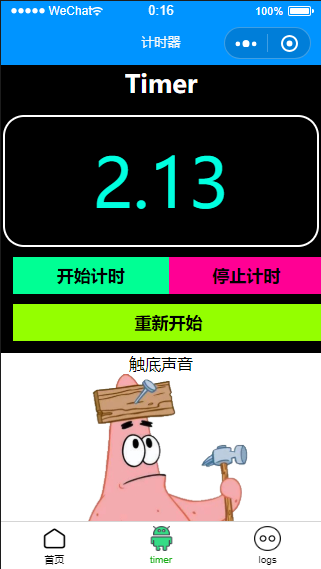

# NCUTMOOCWeChatMiniProgramUnitworks

---

## 北方工业大学杜老师Mooc课程地址
https://www.icourse163.org/learn/NCUT-1206419808?tid=1450238453#/learn/announce

---

## Week3 关于计时器的一个bug及解决       Feb 27th, 2020

做作业的时候发现：

  当  多次（连续，非快速）  点击“开始计时”时，时间会根据你点击的次数进行 每秒*点击次数  跃变，并且无法停止计时

  例如，连续点击两下开始计时，时间会每秒连续-1两次，隔一秒从46（看得到45）变到44,下一秒44到42，此时点击停止计时，会恢复成每秒-1，但是再也无法停止

  研究了一下代码，猜测是因为每次的start()函数中无条件调用了timer()函数，导致num--操作叠加，至于为何会叠加甚至无法停止，我也不太清楚（早知道当初学HTML的时候好好把JS学透了），希望老师看到&&有空的话可以做一个解说

```javascript
start: function() { //开始计时函数
   var that = this;
   timerID = setInterval(() => {
     that.timer()
   }, 1000) //每隔1s调用一次timer函数，注意与setTimeout区别，一个是一次，一个是连续多次，而且这里有timerID
},
```

在作业中尝试了一下可以利用一个标识变量flag很简单地解决这个bug，代码有些不一样，不妨碍理解

```javascript
data: {
    btncolor:[ "#00ff94","#ff0094","#94ff00" ],
    num: num,
    flag: flag
},

start: function() {
    var that=this;
    if ( flag==1 ){
        timerID = setInterval(() => {
        that.timer()
    	}, 10);
    	flag = 0;
    }
},
stop: function() {
    var that = this;
    flag = 1;
    clearInterval(timerID)
    },
    restart: function() {
        var that=this;
        num = 0;
        flag = 1;
        that.setData({
            num:0
    })
},

timer: function() {
    var that=this;
    console.log(num,flag)
    if ( num >= 0 && num <=999999 ){  /*避免无限计时*/
            that.setData({
            num: (num+=0.01).toFixed(2)
        })
        } else {
            that.setData({
            num:0
        })
        console.log(num,flag)
    }
},
```

效果：



---


## Week5 四向九九乘法表 March,20 th

两个点，

-  i与j的变化规律
- 如何靠右排版


代码：

```javascript
<!--pages/chfb/chfb.wxml-->
<!-- <text>pages/chfb/chfb.wxml</text> -->
<!-- 本想用类似递归的方法，奈何wx:for只能用于数组对象 -->
<!-- inline-block为行内块元素，想让其内部块靠右,在父元素里面使用text-align -->
<view class="con">
    <view class="chfbox">
        <view wx:for="123456789" wx:for-item="i">
            <view class="inlineblock" wx:for="123456789" wx:for-item="j" wx:if="{{j<=i}}">
                {{j}}x{{i}}={{i*j}}
            </view>
        </view>
    </view>
-------------------------------------------------------------------------
    <view class="chfbox">
        <view wx:for="987654321" wx:for-item="i">
            <view class="inlineblock" wx:for="123456789" wx:for-item="j" wx:if="{{j<=i}}">
                {{j}}x{{i}}={{i*j}}
            </view>
        </view>
    </view>
-------------------------------------------------------------------------
    <view class="chfbox">
        <view wx:for="123456789" wx:for-item="i" style="text-align:right;">
            <view class="inlineblock2" wx:for="987654321" wx:for-item="j" wx:if="{{j<=i}}">
                {{i*j}}={{i}}x{{j}}
            </view>
        </view>
    </view>
-------------------------------------------------------------------------
    <view class="chfbox">
        <view wx:for="987654321" wx:for-item="i" style="text-align:right;">
            <view class="inlineblock2" wx:for="987654321" wx:for-item="j" wx:if="{{j<=i}}">
                {{i*j}}={{i}}x{{j}}
            </view>
        </view>
    </view>
</view>
```

效果：


学的很渣，欢迎交流指教！